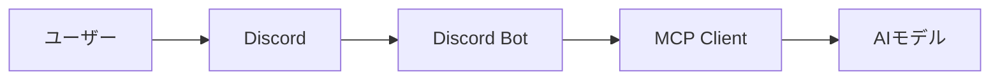
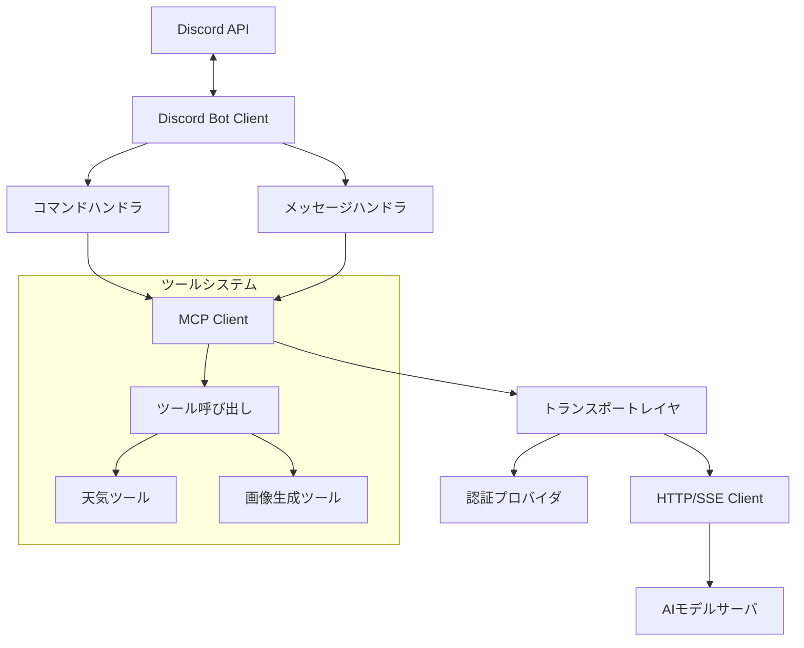
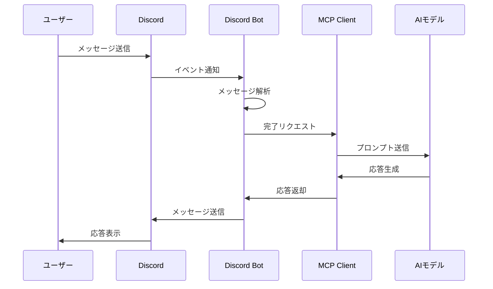
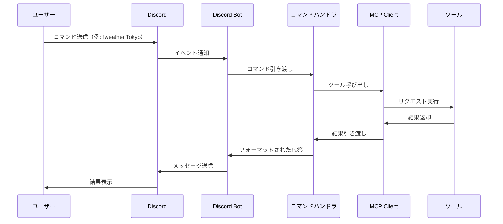
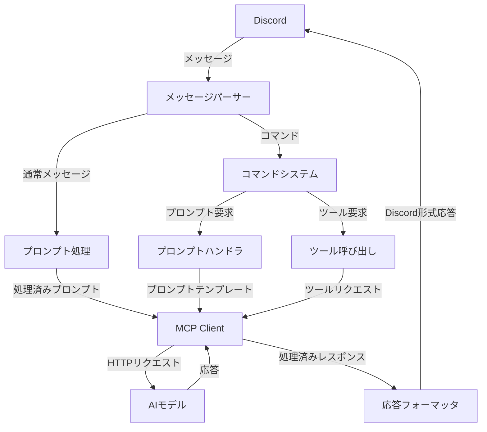
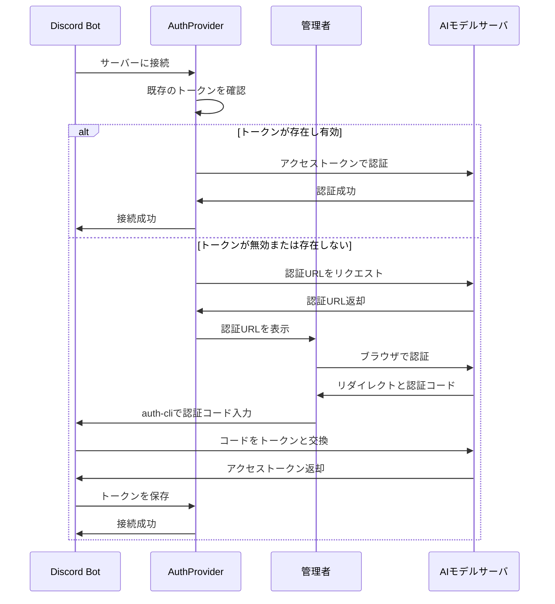
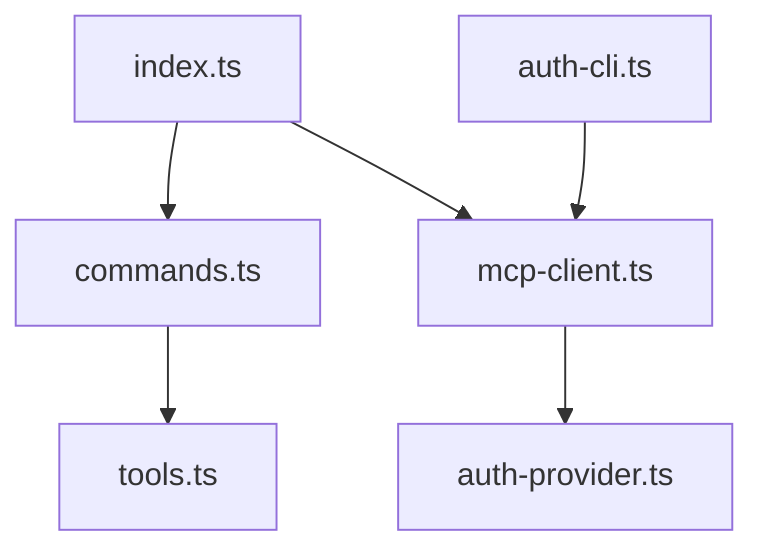
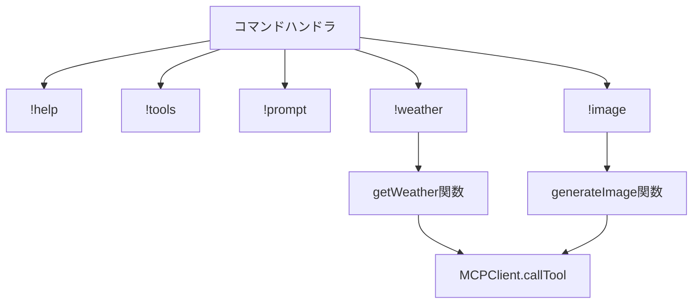
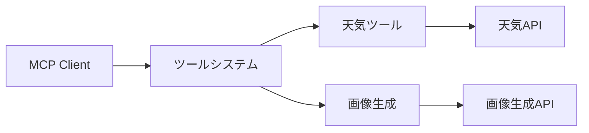
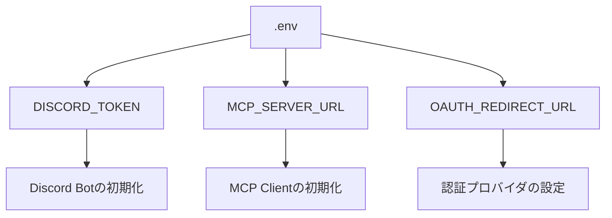

# Discord MCP Client ドキュメント

このディレクトリには、Discord MCP Clientの設計、実装、使用方法に関するドキュメントが含まれています。

## 目次

- [アーキテクチャ概要](#アーキテクチャ概要)
- [コンポーネント図](#コンポーネント図)
- [シーケンス図](#シーケンス図)
- [データフロー](#データフロー)
- [認証フロー](#認証フロー)
- [ファイル構造](#ファイル構造)
- [コマンドシステム](#コマンドシステム)
- [ツール統合](#ツール統合)
- [設定オプション](#設定オプション)

## アーキテクチャ概要

Discord MCP Clientは、Discord BotとAIモデルを接続するためのブリッジとして機能します。Model Context Protocol (MCP)を活用して、異なるAIモデルプロバイダと標準化されたインターフェースで通信します。

## コンポーネント図

以下は、システムの主要コンポーネントとその関係を示します。

## シーケンス図

### 基本的なメッセージフロー

### コマンド実行フロー

## データフロー

## 認証フロー

OAuth 2.0認証フローの流れ：

## ファイル構造

プロジェクトのファイル構造とその関係：

## コマンドシステム

実装されているコマンドの階層と関係：

## ツール統合

AIモデルを通して呼び出すことのできるツール：

## 設定オプション

環境変数の設定関係：

