# 認証システムガイド

このドキュメントでは、Discord MCP Clientで実装されている認証システムについて詳しく説明します。MCPサーバーとの安全な通信を確立するためのOAuth 2.0認証フローの仕組みと実装方法を紹介します。

## 認証システム概要

Discord MCP Clientは、OAuth 2.0認証コードフローを使用してAIモデルサーバーと通信します。

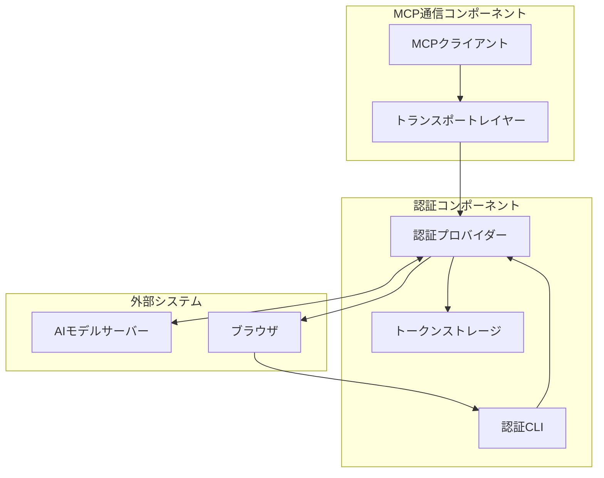

## 認証フロー詳細

OAuth 2.0認証コードフローの詳細なステップ：

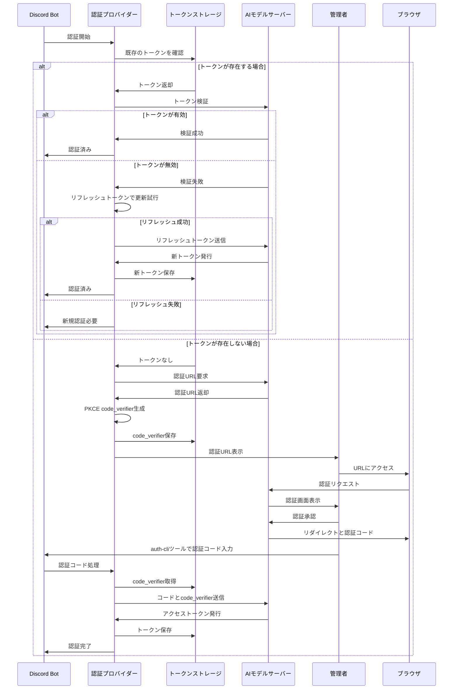

## 認証プロバイダーの実装

`auth-provider.ts`ファイルで実装されているOAuthClientProviderインターフェース：

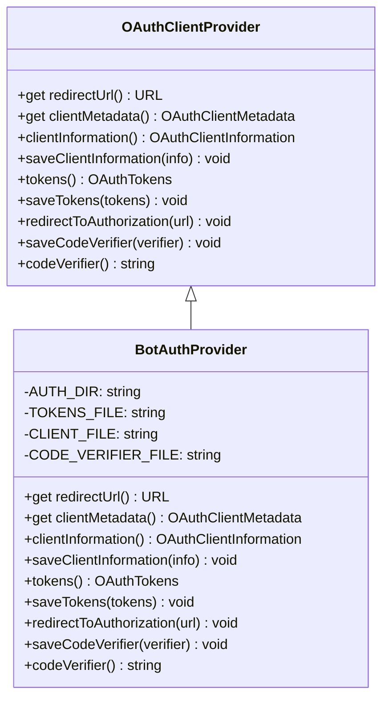

## データ構造

認証システムで使用される主要なデータ構造：

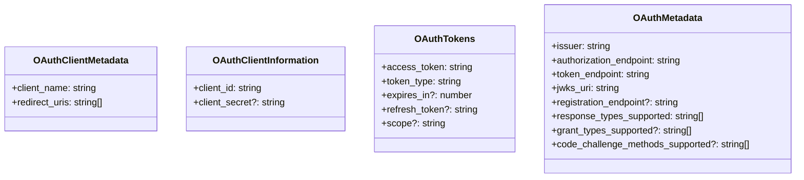

## 認証フローの状態遷移

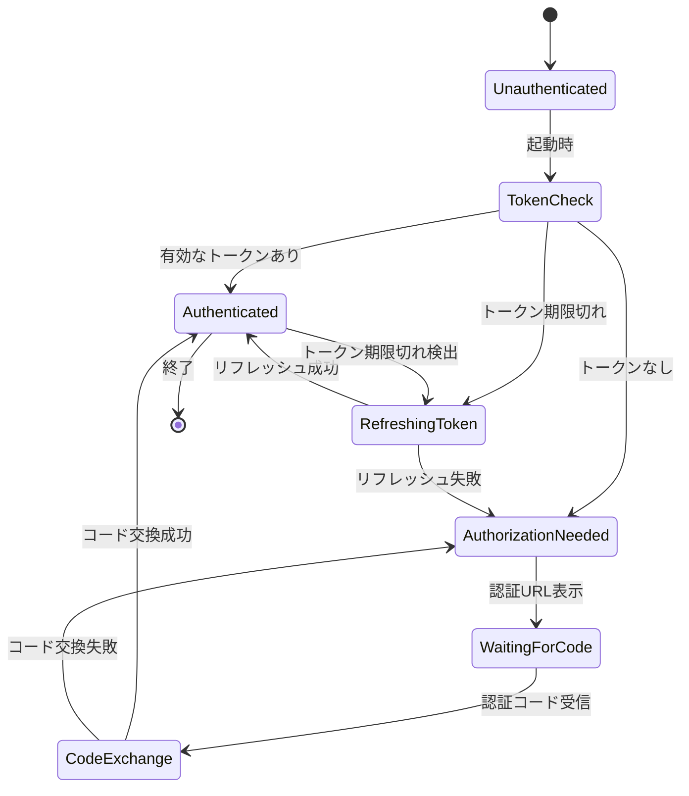

## ファイルストレージシステム

認証情報の永続化方法：

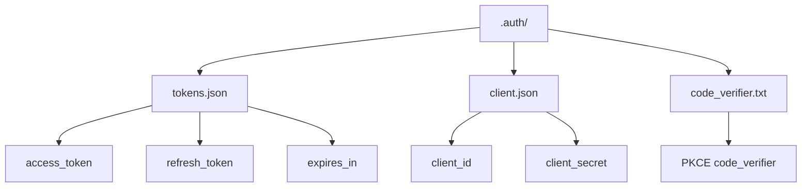

## 認証CLI

認証コードを処理するためのコマンドラインインターフェース：

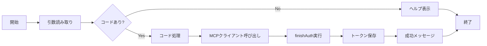

## トークン管理

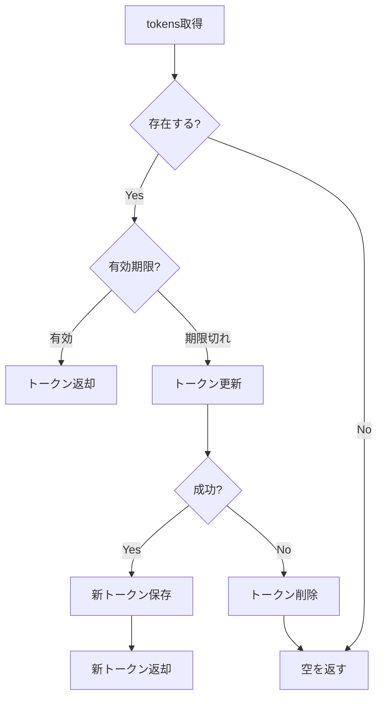

## セキュリティ考慮事項

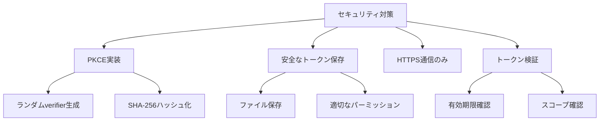

## 実装ガイド

### 1. 環境変数の設定

`.env`ファイルに必要な変数を設定します：

```bash
# MCP認証設定
MCP_SERVER_URL=https://your-mcp-server.example.com
OAUTH_REDIRECT_URL=http://localhost:3000/callback
```

### 2. 認証コードの取得とトークン交換

以下のステップで認証コードを取得し、アクセストークンと交換します：

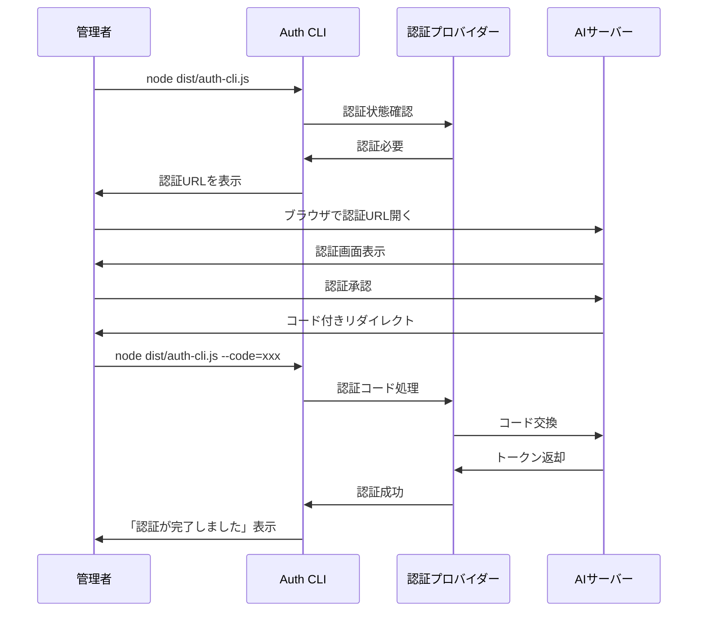

### 3. 動的クライアント登録

サーバーが動的クライアント登録をサポートしている場合の処理：

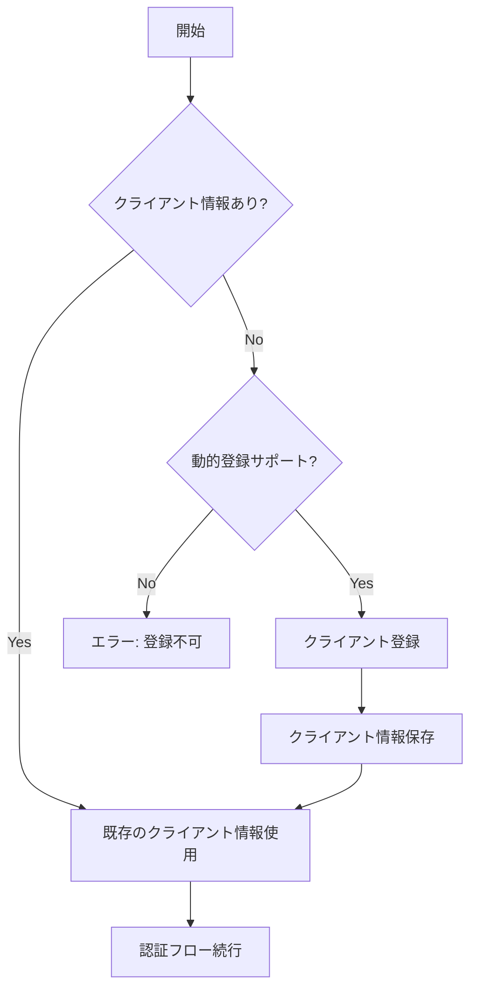

### 4. トランスポート層との統合

認証プロバイダーをトランスポートレイヤーと統合：

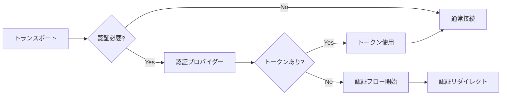

## エラーハンドリング

認証プロセス中の様々なエラー状態の処理：

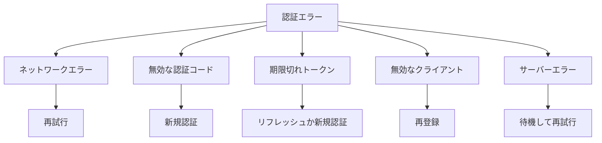

## ベストプラクティス

1. **トークンの安全な保存**: ファイルシステムのパーミッションを適切に設定
2. **定期的なリフレッシュ**: トークンの有効期限前に自動リフレッシュ
3. **エラー耐性**: 認証エラーからの自動リカバリー
4. **ログ記録**: 認証プロセスの詳細ログの記録（秘密情報は除く）

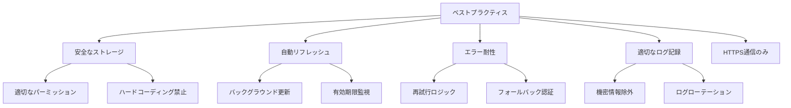

## カスタム認証プロバイダーの作成

独自の認証プロバイダーを実装するためのガイドライン：

1. `OAuthClientProvider`インターフェースを実装
2. 独自のストレージメカニズムを提供
3. UIへの通知方法をカスタマイズ

```typescript
// カスタム認証プロバイダーの例
class CustomAuthProvider implements OAuthClientProvider {
  // OAuthClientProviderインターフェースのメソッドを実装
  get redirectUrl(): string { /* ... */ }
  get clientMetadata() { /* ... */ }
  async clientInformation() { /* ... */ }
  async saveClientInformation(clientInfo) { /* ... */ }
  async tokens() { /* ... */ }
  async saveTokens(tokens) { /* ... */ }
  async redirectToAuthorization(authUrl) { /* ... */ }
  async saveCodeVerifier(codeVerifier) { /* ... */ }
  async codeVerifier() { /* ... */ }
}
```
