# ツール統合ガイド

このドキュメントでは、Discord MCP Clientのツール統合システムについて詳しく説明します。Model Context Protocol (MCP)を使用してDiscord Bot経由でAIモデルのツール呼び出し機能を活用する方法を紹介します。

## ツールシステム概要

MCPのツール呼び出しシステムにより、AIモデルは外部機能（天気情報の取得、画像生成など）にアクセスできます。

```mermaid
graph LR
    Discord[Discord] --> Bot[Discord Bot]
    Bot --> CommandHandler[コマンドハンドラ]
    CommandHandler --> ToolInterface[ツールインターフェース]
    ToolInterface --> MCPClient[MCP Client]
    MCPClient --> AIModel[AIモデル]
    AIModel --> ToolExecution[ツール実行]
    ToolExecution --> ExternalAPI[外部API]
    ExternalAPI --> ToolExecution
    ToolExecution --> AIModel
    AIModel --> MCPClient
    MCPClient --> ToolInterface
    ToolInterface --> CommandHandler
    CommandHandler --> Bot
    Bot --> Discord
```

## ツール呼び出しフロー

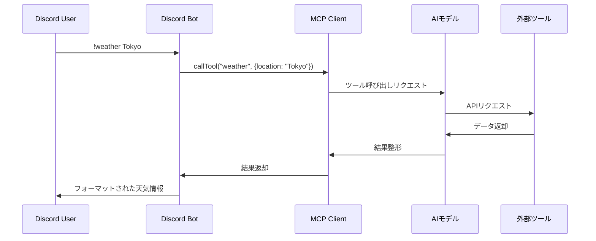

## ツール実装方法

Discord MCP Clientに新しいツールを追加するプロセス：

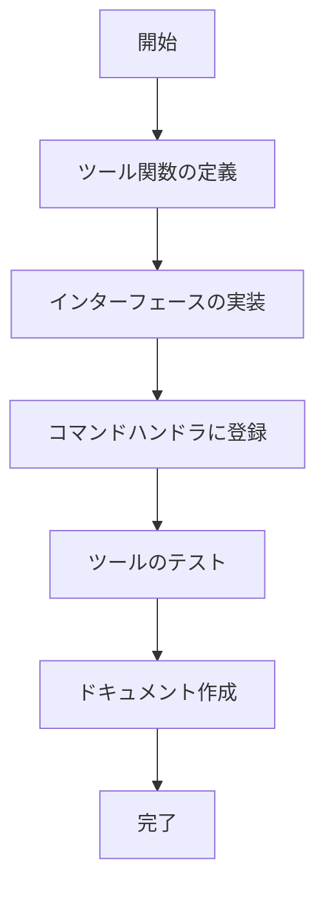

### ステップ1: ツール関数の作成

`tools.ts`に新しいツール関数を追加：

```typescript
/**
 * 新しいツール関数のテンプレート
 */
export async function newTool(message: Message, mcpClient: MCPClient, ...args: any[]) {
  try {
    // ユーザーに処理中を伝える
    await message.channel.sendTyping();
    
    // ツール呼び出し
    const result = await mcpClient.callTool({
      name: 'tool-name',
      args: { /* ツールに必要な引数 */ }
    });
    
    // 結果処理
    if (result.success) {
      // 成功時の処理
      await message.reply("処理結果: " + JSON.stringify(result.result));
    } else {
      // エラー時の処理
      await message.reply(`エラーが発生しました: ${result.error || '不明なエラー'}`);
    }
  } catch (error) {
    // 例外処理
    console.error('Error calling tool:', error);
    await message.reply('ツール実行中にエラーが発生しました。');
  }
}
```

### ステップ2: コマンドハンドラに登録

`commands.ts`のコマンドマップに追加：

```typescript
const commands: Record<string, CommandHandler> = {
  // 既存のコマンド
  
  // 新しいコマンド
  async newtool(message, args, mcpClient) {
    if (args.length === 0) {
      await message.reply('使用法: !newtool <引数>');
      return;
    }
    
    const toolArg = args.join(' ');
    await newTool(message, mcpClient, toolArg);
  }
};
```

## 事前定義されたツール

### 1. 天気情報ツール

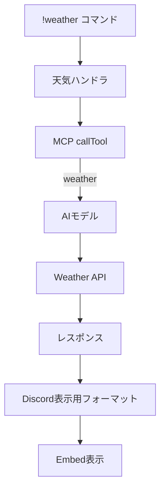

**実装**: `getWeather`関数はMCPの`callTool`メソッドを使って`weather`ツールを呼び出し、場所に基づいた天気情報を取得します。

**応答フォーマット**:
```typescript
interface WeatherResponse {
  temperature: number;  // 摂氏温度
  condition: string;    // 天気状態（晴れ、雨など）
  humidity: number;     // 湿度（%）
  wind_speed?: number;  // 風速（m/s）
}
```

### 2. 画像生成ツール

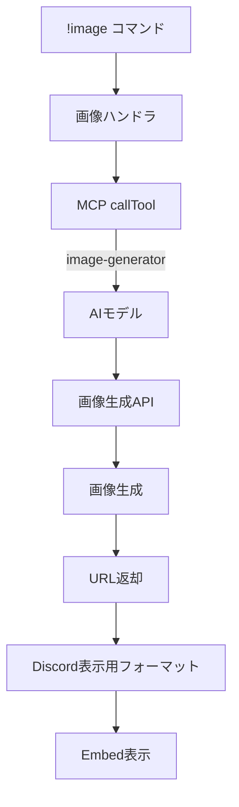

**実装**: `generateImage`関数はMCPの`callTool`メソッドを使って`image-generator`ツールを呼び出し、指定された説明に基づいて画像を生成します。

**応答フォーマット**:
```typescript
interface ImageResponse {
  url: string;          // 生成された画像のURL
  width?: number;       // 画像の幅
  height?: number;      // 画像の高さ
  prompt?: string;      // 使用されたプロンプト
}
```

## 独自ツールの実装例

### カレンダーツール

以下は、カレンダー操作のためのツール実装例です：

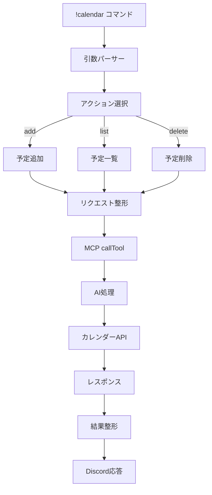

### ウェブ検索ツール

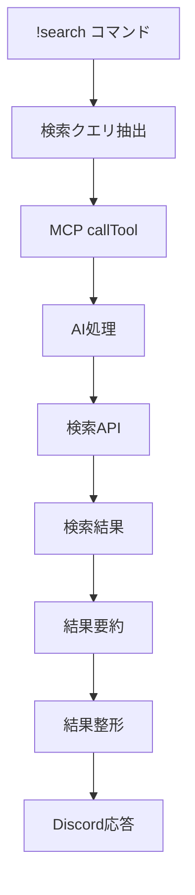

## エラーハンドリング

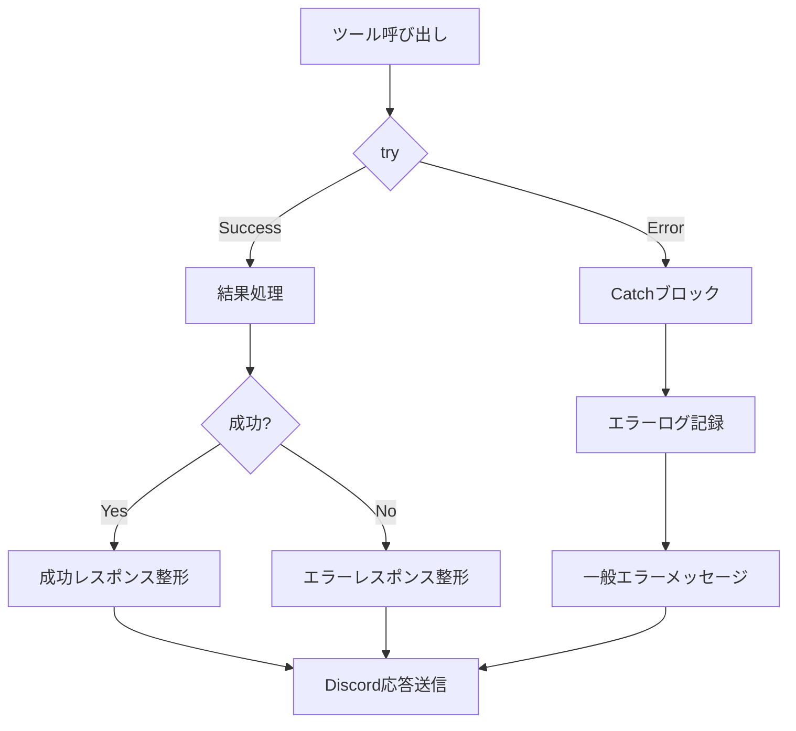

## パフォーマンス考慮事項

1. **タイムアウト処理**: 長時間実行ツールの場合は適切なタイムアウト処理を実装
2. **並列実行**: 複数ツールの並列実行による効率化
3. **キャッシュ**: 頻繁に使用される結果のキャッシュ

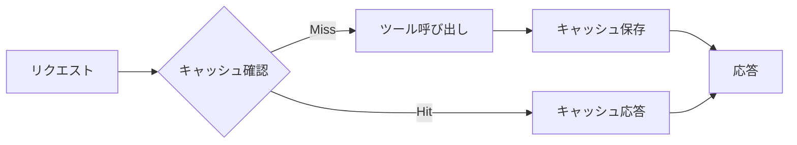

## ツール管理と監視

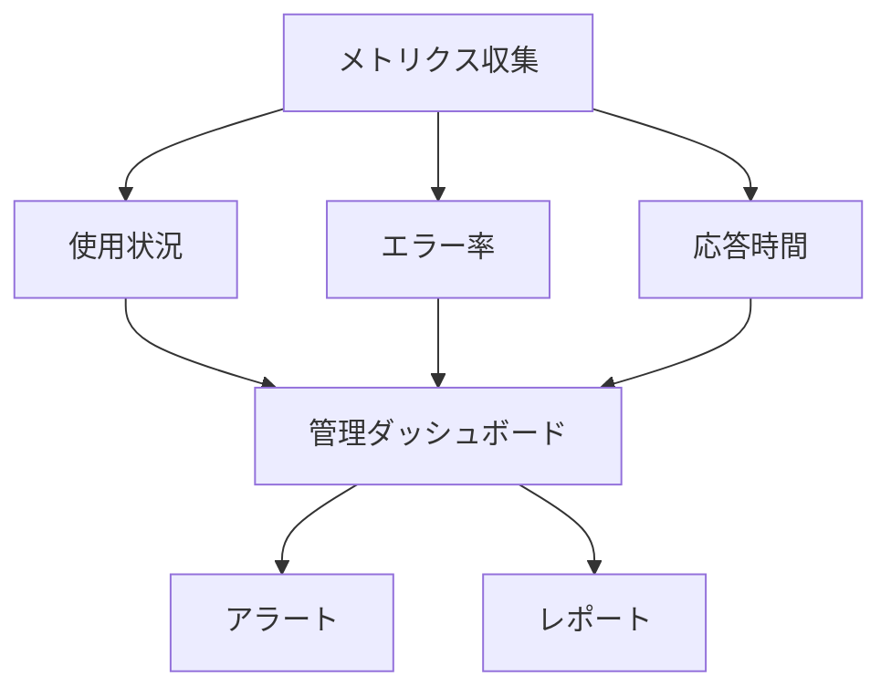

## セキュリティ考慮事項

1. **入力検証**: ユーザー入力の厳格な検証
2. **アクセス制限**: ロールベースのツールアクセス制御
3. **レート制限**: 過剰な使用の防止
4. **監査ログ**: ツール呼び出しの詳細ログ記録

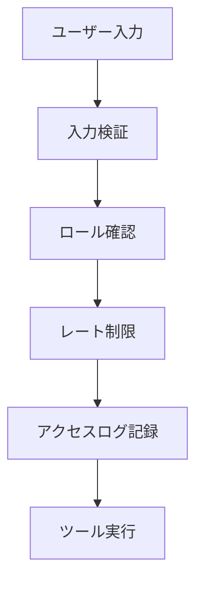
